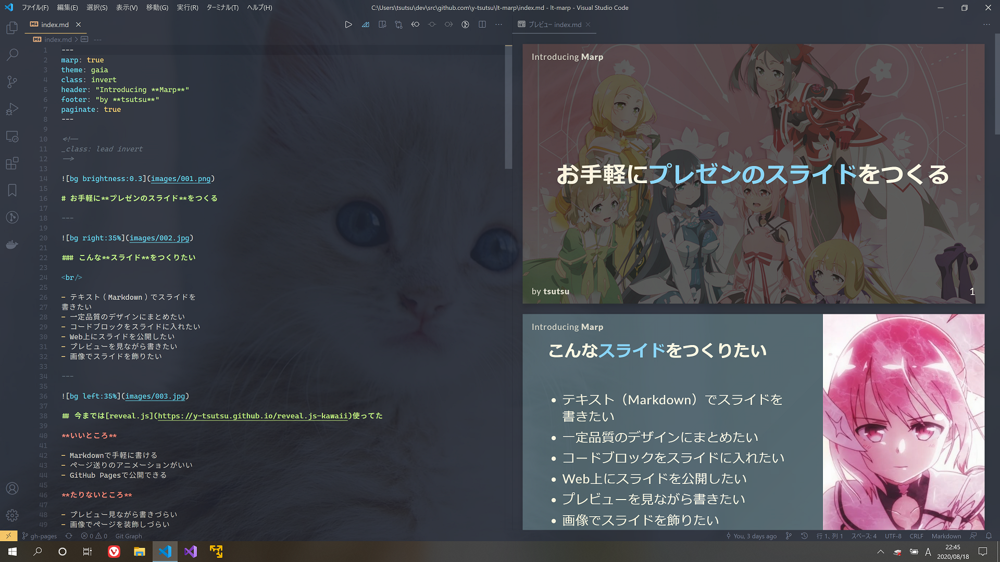

<!--
_class: lead invert
-->


# お手軽に書ける**スライド**作成ツール

---


### こんな**スライド**をつくりたい

<br/>

- テキスト（Markdown）でスライドを
書きたい
- 一定品質のデザインにまとめたい
- コードブロックをスライドに入れたい
- Web上にスライドを公開したい
- プレビューを見ながら書きたい
- 画像でスライドを飾りたい

---


## 今までは[reveal.js](https://y-tsutsu.github.io/reveal.js-kawaii)使ってた

**いいところ**

- Markdownで手軽に書ける
- ページ送りのアニメーションがいい
- GitHub Pagesで公開できる

**たりないところ**

- プレビュー見ながら書きづらい
- 画像でページを装飾しづらい

---

<!--
_class: default
-->


### [Marp](https://github.com/marp-team/marp)なら痒いところに手が届く

<br/>

* こんな感じに画像で装飾できる
* テーマ(色)もページごとに指定できる
* 純粋なMarkdownファイルだけでOK
(reveal.jsはコードをスライドに同梱する必要がある)
* 箇条書きのアニメーションもできる

---


### 先頭に**YAML**ヘッダを書くだけ


スライド形式でプレビューされる

```
---
marp: true
theme: gaia
class: invert
header: "Introducing **Marp**"
footer: "by **tsutsu**"
paginate: true
---
# ページ1
---
# ページ2
```

---

<!--
_class: lead invert
-->

## 画像の表示が**柔軟**に行える


   
  

---

### **VSCode**なら簡単に書ける



<br/>

* Marp for VS Code拡張を入れる
だけですぐ使える
* プレビューしながら書ける
* HTMLやPDFにエクスポートできる
* 使い慣れたエディタでスライドが
書ける

---


# **今日**のまとめ

<br/>

- Marpを使えばMarkdownで手軽に奇麗なスライドが書ける
- 画像を使った装飾もできる
- Markdownの1ファイルだけでOK
- HTMLに出力できるからGitHub Pagesで公開できる
- VSCodeを使えばより便利

---

<!--
_class: lead invert
-->


# Thank **You** for Reading :smiley:
